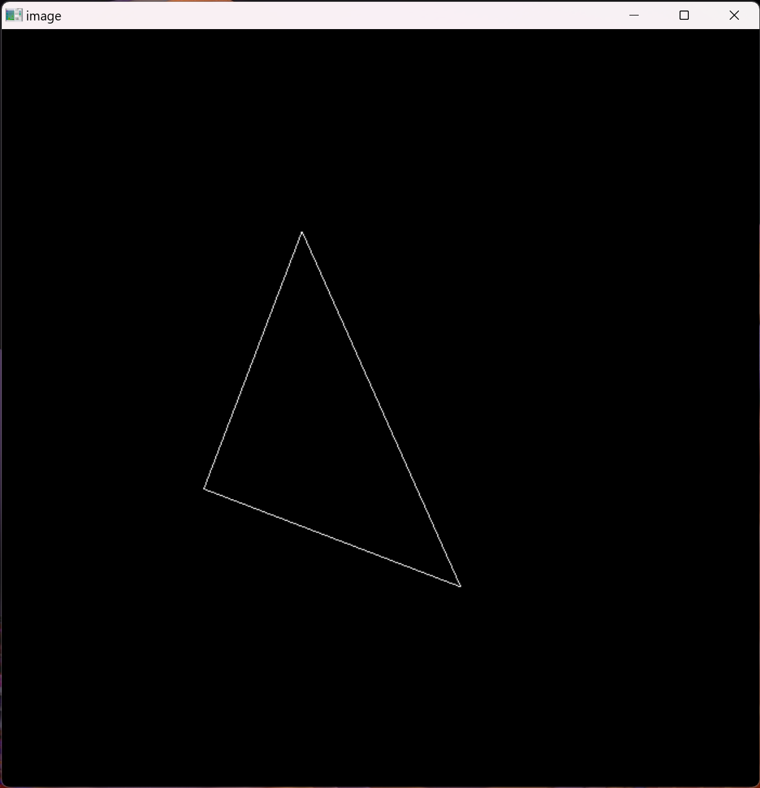

# Games101Homeworks
Games101‘s Homeworks
## Assignment0 配置环境
安装eigen即可
## Assignment1 填写一个旋转矩阵和一个透视投影矩阵
### 配置环境
#### 下载MinGW
https://github.com/Vuniverse0/mingwInstaller/releases  
添加环境变量到path：C:\Users\Yezi\mingw64\bin
#### 下载cmake
https://cmake.org/download/
#### 下载opencv
https://opencv.org/releases/
#### 编译opencv
https://blog.csdn.net/Dylan_YQ/article/details/122677627
```
mingw32-make -j 16
mingw32-make install
```
### 一个旋转矩阵
get_model_matrix(float rotation_angle): 逐个元素地构建模型变换矩
阵并返回该矩阵。在此函数中，你只需要实现三维中绕 z 轴旋转的变换矩阵，
而不用处理平移与缩放。
#### 思路
直接写一个绕Z轴旋转的矩阵返回即可
### 一个透视投影矩阵
get_projection_matrix(float eye_fov, float aspect_ratio, float
zNear, float zFar): 使用给定的参数逐个元素地构建透视投影矩阵并返回
该矩阵。
#### 思路
先做透视投影，然后做正交投影，正交投影=平移+缩放  
平移到原点，缩放到一个标准正方体[-1,1]³中  
n 对应 zNear，f 对应 zFar，fovY 对应 eye_fov，aspect 对应 asoect_ratio  

## Assignment2 光栅化三角形
### 判断点是否在三角形内
static bool insideTriangle(): 测试点是否在三角形内。
#### 思路
叉乘可以用来判断一个点是否在一个多边形内部，如P点，如果AP×AB和BP×BC和CP×CA的方向是一样的，那么这个P点就在三角形内部
### 光栅化三角形
rasterize_triangle()
#### 思路
先建立起一个矩形框框住三角形  
遍历矩形框内每个像素，判断该像素是否在三角形内  
如果在三角形内，插值计算深度，更新depth buffer  
渲染该像素

三角形颠倒问题  
https://zhuanlan.zhihu.com/p/509902950