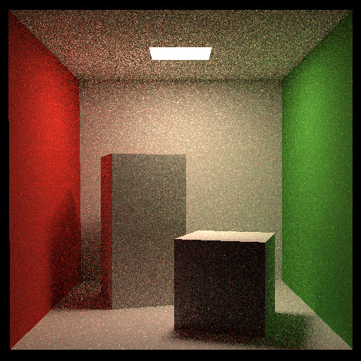
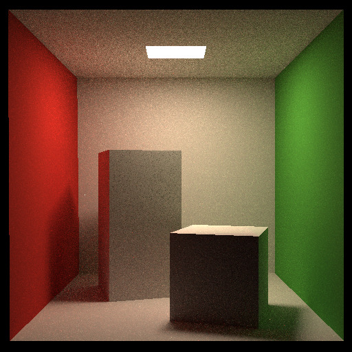
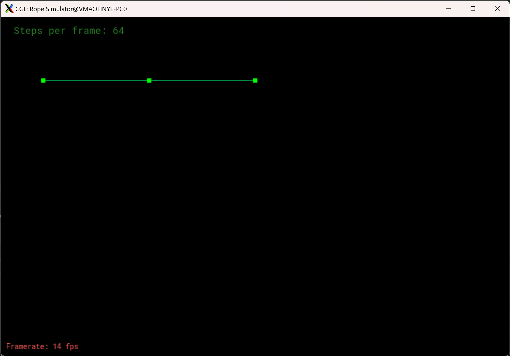
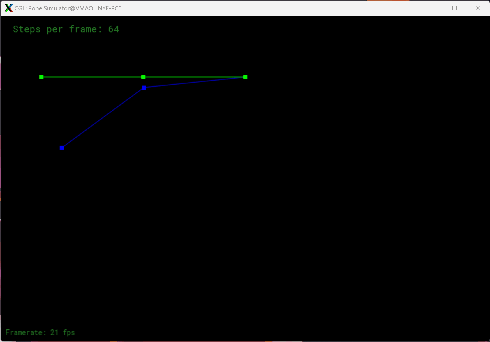
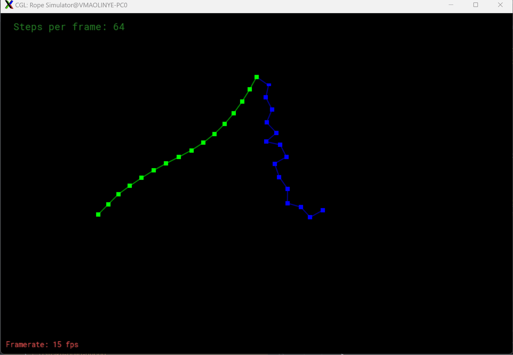

# Games101Homeworks
学习内容涵盖MVP变换、光栅化成像、MSAA抗锯齿、深度缓冲、Blinn-Phong着色模型、平面着色、高洛德顶点着色、Phong像素着色、实时渲染管线、纹理映射、纹理应用（凹凸贴图、位移贴图）、几何表示、贝塞尔曲线、曲面、Shadow Mapping阴影映射、Whitted-Style光线追踪、BVH加速、渲染方程、路径追踪、材质、物理模拟与仿真  
作业内容实现矩阵变换、深度缓冲、光栅化成像、插值、纹理映射、Blinn-Phong着色、凹凸贴图、位移贴图、贝塞尔曲线、Whitted-Style光线追踪、BVH加速、路径追踪、质点弹簧系统
## Assignment0 配置环境
安装eigen即可
```c++
    Eigen::Vector3d p(2, 1, 1);
    int theta = 45;
    Eigen::Matrix3d rotate, translate;
    rotate << cos(theta), -sin(theta), 0, sin(theta), cos(theta), 0, 0, 0, 1;
    p = rotate * p;
    cout << p << endl;
    translate << 1, 0, 1, 0, 1, 2, 0, 0, 1;
    p = translate * p;
    cout << p;
```
## Assignment1 填写一个旋转矩阵和一个透视投影矩阵
### 配置环境
#### 下载MinGW
https://github.com/Vuniverse0/mingwInstaller/releases  
添加环境变量到path：C:\Users\Yezi\mingw64\bin
#### 下载cmake
https://cmake.org/download/
#### 下载opencv
https://opencv.org/releases/
#### 编译opencv
https://blog.csdn.net/Dylan_YQ/article/details/122677627
```
mingw32-make -j 16
mingw32-make install
```
### 一个旋转矩阵
get_model_matrix(float rotation_angle): 逐个元素地构建模型变换矩
阵并返回该矩阵。在此函数中，你只需要实现三维中绕 z 轴旋转的变换矩阵，
而不用处理平移与缩放。
#### 思路
直接写一个绕Z轴旋转的矩阵返回即可
```c++
    model << cos(rotation_angle), -sin(rotation_angle), 0, 0,
            sin(rotation_angle), cos(rotation_angle), 0, 0,
            0, 0, 1, 0,
            0, 0, 0, 1;
```
### 一个透视投影矩阵
get_projection_matrix(float eye_fov, float aspect_ratio, float
zNear, float zFar): 使用给定的参数逐个元素地构建透视投影矩阵并返回
该矩阵。
#### 思路
先做透视投影，然后做正交投影，正交投影=平移+缩放  
平移到原点，缩放到一个标准正方体[-1,1]³中  
n 对应 zNear，f 对应 zFar，fovY 对应 eye_fov，aspect 对应 asoect_ratio  
```c++
    Eigen::Matrix4f perspective = Eigen::Matrix4f::Identity();
    perspective << zNear, 0, 0, 0,
            0, zNear, 0, 0,
            0, 0, zNear + zFar, -zNear * zFar,
            0, 0, 1, 0;
    Eigen::Matrix4f transform = Eigen::Matrix4f::Identity();
    float t=tan(eye_fov/2)*fabs(zNear);
    float r=aspect_ratio*t;
    float l=-r,b=-t;
    transform(0,3)=-(r+l)/2;
    transform(1,3)=-(t+b)/2;
    transform(2,3)=-(zNear+zFar)/2;
    Eigen::Matrix4f scale = Eigen::Matrix4f::Identity();
    scale(0,0)=2/(r-l);
    scale(1,1)=2/(t-b);
    scale(2,2)=2/(zNear-zFar)/2;
    projection=scale*transform*perspective;
```

## Assignment2 光栅化三角形
### 判断点是否在三角形内
static bool insideTriangle(): 测试点是否在三角形内。
#### 思路
叉乘可以用来判断一个点是否在一个多边形内部，如P点，如果AP×AB和BP×BC和CP×CA的方向是一样的，那么这个P点就在三角形内部
```c++
    float AB_AP=(v[1].x()-v[0].x())*(y-v[0].y())-(v[1].y()-v[0].y())*(x-v[0].x());
    float BC_BP=(v[2].x()-v[1].x())*(y-v[1].y())-(v[2].y()-v[1].y())*(x-v[1].x());
    float CA_CP=(v[0].x()-v[2].x())*(y-v[2].y())-(v[0].y()-v[2].y())*(x-v[2].x());
    if((AB_AP>0)==(BC_BP>0)&&(BC_BP>0)==(CA_CP>0))
        return true;
    return false;
```
### 光栅化三角形
rasterize_triangle()
#### 思路
先建立起一个矩形框框住三角形  
遍历矩形框内每个像素，判断该像素是否在三角形内  
如果在三角形内，插值计算深度，更新depth buffer  
渲染该像素
```c++
    int minx=std::min(v[0].x(),std::min(v[1].x(),v[2].x()));
    int miny=std::min(v[0].y(),std::min(v[1].y(),v[2].y()));
    int maxX=std::max(v[0].x(),std::max(v[1].x(),v[2].x()));
    int maxY=std::max(v[0].y(),std::max(v[1].y(),v[2].y()));
    for(int x=minx;x<=maxX;x++){
        for(int y=miny;y<=maxY;y++){
            if(insideTriangle(x,y,t.v)){
                auto[alpha, beta, gamma] = computeBarycentric2D(x, y, t.v);
                float w_reciprocal = 1.0/(alpha / v[0].w() + beta / v[1].w() + gamma / v[2].w());
                float z_interpolated = alpha * v[0].z() / v[0].w() + beta * v[1].z() / v[1].w() + gamma * v[2].z() / v[2].w();
                z_interpolated *= w_reciprocal;
                if(z_interpolated<depth_buf[get_index(x,y)]){
                    depth_buf[get_index(x,y)]=z_interpolated;
                    set_pixel(Eigen::Vector3f(x,y,1),t.getColor());
                }
            }
        }
    }
```

三角形颠倒问题  
https://zhuanlan.zhihu.com/p/509902950
## Assignment3 插值 纹理映射 blinn-phone反射模型 凹凸贴图 位移贴图
### 任务
1. 修改函数 rasterize_triangle(const Triangle& t) in rasterizer.cpp: 在此处实现与作业 2 类似的插值算法，实现法向量、颜色、纹理颜色的插值。
2. 修改函数 get_projection_matrix() in main.cpp: 将你自己在之前的实验中实现的投影矩阵填到此处，此时你可以运行./Rasterizer output.png normal 来观察法向量实现结果。
3. 修改函数 phong_fragment_shader() in main.cpp: 实现 Blinn-Phong 模型计算Fragment Color.
4. 修改函数 texture_fragment_shader() in main.cpp: 在实现 Blinn-Phong 的基础上，将纹理颜色视为公式中的 kd，实现 Texture Shading Fragment
   Shader.
5. 修改函数 bump_fragment_shader() in main.cpp: 在实现 Blinn-Phong 的基础上，仔细阅读该函数中的注释，实现 Bump mapping.
6. 修改函数 displacement_fragment_shader() in main.cpp: 在实现 Bump mapping 的基础上，实现 displacement mapping.
### 解决
#### 1. 修改函数 rasterize_triangle(const Triangle& t) in rasterizer.cpp: 在此处实现与作业 2 类似的插值算法，实现法向量、颜色、纹理颜色的插值。  
先把作业2的拉过来，增加对法向量、颜色、纹理颜色与底纹颜色 (Shading Colors) 的插值
```c++
    auto v = t.toVector4();
    int minx=std::min(v[0].x(),std::min(v[1].x(),v[2].x()));
    int miny=std::min(v[0].y(),std::min(v[1].y(),v[2].y()));
    int maxX=std::max(v[0].x(),std::max(v[1].x(),v[2].x()));
    int maxY=std::max(v[0].y(),std::max(v[1].y(),v[2].y()));
    for(int x=minx;x<=maxX;x++){
        for(int y=miny;y<=maxY;y++){
            if(insideTriangle(x,y,t.v)){
                auto[alpha, beta, gamma] = computeBarycentric2D(x, y, t.v);
                float w_reciprocal = 1.0/(alpha / v[0].w() + beta / v[1].w() + gamma / v[2].w());
                float z_interpolated = alpha * v[0].z() / v[0].w() + beta * v[1].z() / v[1].w() + gamma * v[2].z() / v[2].w();
                z_interpolated *= w_reciprocal;
                if(z_interpolated<depth_buf[get_index(x,y)]){
                    auto interpolated_color= interpolate(alpha,beta,gamma,t.color[0],t.color[1],t.color[2],1);
                    auto interpolated_normal= interpolate(alpha,beta,gamma,t.normal[0],t.normal[1],t.normal[2],1);
                    auto interpolated_texcoords= interpolate(alpha,beta,gamma,t.tex_coords[0],t.tex_coords[1],t.tex_coords[2],1);
                    auto interpolated_shadingcoords= interpolate(alpha,beta,gamma,view_pos[0],view_pos[1],view_pos[2],1);
                    fragment_shader_payload payload( interpolated_color, interpolated_normal.normalized(), interpolated_texcoords, texture ? &*texture : nullptr);
                    payload.view_pos = interpolated_shadingcoords;
                    auto pixel_color = fragment_shader(payload);
                    depth_buf[get_index(x,y)]=z_interpolated;
                    set_pixel(Eigen::Vector2i(x,y),pixel_color);
                }
            }
        }
    }
```
#### 2. 修改函数 get_projection_matrix() in main.cpp: 将你自己在之前的实验中实现的投影矩阵填到此处，此时你可以运行./Rasterizer output.png normal 来观察法向量实现结果。  
对于牛牛倒过来的和之前一样，是因为课程推导中的n和f是坐标，相机是看向-z方向的，这里n和f是距离，感觉像是相机看向z方向的，用了一个对称矩阵将x和y方向镜像就对了
```c++
    Eigen::Matrix4f mirror;
    mirror <<
           -1, 0, 0, 0,
            0, -1, 0, 0,
            0, 0, 1, 0,
            0, 0, 0, 1;
    projection=mirror*scale*transform*perspective;
```

#### 3. 修改函数 phong_fragment_shader() in main.cpp: 实现 Blinn-Phong 模型计算Fragment Color.  
根据blinn-phong反射模型计算就行
```c++
        auto r=light.position-point;
        auto l=r.normalized();
        auto v=(eye_pos-point).normalized();
        auto h=(v+l).normalized();
        Eigen::Vector3f ambient=ka.array()*amb_light_intensity.array();
        Eigen::Vector3f diffuse=kd.array()*light.intensity.array()/r.dot(r)*std::max(0.f,normal.dot(l));
        Eigen::Vector3f specular=ks.array()*light.intensity.array()/r.dot(r)*std::max(0.f,std::pow(normal.dot(h),p));
        result_color=result_color+ambient+diffuse+specular;
```

#### 4. 修改函数 texture_fragment_shader() in main.cpp: 在实现 Blinn-Phong 的基础上，将纹理颜色视为公式中的 kd，实现 Texture Shading Fragment Shader.  
根据纹理坐标映射纹理,这个纹理坐标最后在getcolor那里乘以了纹理图的宽和高，这里需要做一个[0,1]的限制
```c++
        float u=std::max(0.f,std::min(payload.tex_coords.x(),1.f));
        float v=std::max(0.f,std::min(payload.tex_coords.y(),1.f));
        return_color=payload.texture->getColor(u,v);
```

#### 5. 修改函数 bump_fragment_shader() in main.cpp: 在实现 Blinn-Phong 的基础上，仔细阅读该函数中的注释，实现 Bump mapping.  
已有的代码中的TBN矩阵用于将局部的切线空间转换为世界坐标系，根据纹理存储的相对高度计算出新的法线方向，注意使用1.f进行计算，否则是整除结果不对，然后是u+1和v+1这个1是要除以纹理的宽高，因为后面计算纹理坐标的时候会再乘以纹理宽高
```c++
    auto [x, y, z] = std::tie(normal.x(), normal.y(), normal.z());
    Eigen::Vector3f t(x * y / sqrt(x * x + z * z), sqrt(x * x + z * z), z * y / sqrt(x * x + z * z));
    auto b = normal.cross(t);
    Eigen::Matrix3f TBN;
    TBN << t.x(), b.x(), x,
            t.y(), b.y(), y,
            t.z(), b.z(), z;
    auto h = [&payload](float u, float v) -> float { return payload.texture->getColor(u, v).norm(); };
    float u = std::max(0.f, std::min(payload.tex_coords.x(), 1.f));
    float v = std::max(0.f, std::min(payload.tex_coords.y(), 1.f));
    auto dU = kh * kn * (h(u+1.f/payload.texture->width,v)-h(u,v));
    auto dV = kh * kn * (h(u,v+1.f/payload.texture->height)-h(u,v));
    Eigen::Vector3f ln(-dU, -dV, 1);
    normal= (TBN * ln).normalized();
```

#### 6. 修改函数 displacement_fragment_shader() in main.cpp: 在实现 Bump mapping 的基础上，实现 displacement mapping.  
在上一个的基础上修改着色点的位置就行
```c++
    point=point+kn * normal * h(u,v);
```

## Assignment4 贝塞尔曲线
### bezier
该函数实现绘制 Bézier 曲线的功能。它使用一个控制点序列和一个
OpenCV：：Mat 对象作为输入，没有返回值。它会使 t 在 0 到 1 的范围内进
行迭代，并在每次迭代中使 t 增加一个微小值。对于每个需要计算的 t，将
调用另一个函数 recursive_bezier，然后该函数将返回在 Bézier 曲线上 t
处的点。最后，将返回的点绘制在 OpenCV ：：Mat 对象上
```c++
    for (double t = 0.0; t <= 1.0; t += 0.001) {
        auto point = recursive_bezier(control_points, t);
        window.at<cv::Vec3b>(point.y, point.x)[1] = 255;
    }
```
### De Casteljau 算法
1. 考虑一个 p0, p1, ... pn 为控制点序列的 Bézier 曲线。首先，将相邻的点连接起来以形成线段。
2. 用 t : (1 − t) 的比例细分每个线段，并找到该分割点。
3. 得到的分割点作为新的控制点序列，新序列的长度会减少一。
4. 如果序列只包含一个点，则返回该点并终止。否则，使用新的控制点序列并转到步骤 1。
```c++
    if (control_points.size() == 1)
        return control_points[0];
    std::vector<cv::Point2f> points;
    for (int i = 0; i < control_points.size() - 1; i++) {
        int x = (1 - t) * control_points[i].x + t * control_points[i + 1].x;
        int y = (1 - t) * control_points[i].y + t * control_points[i + 1].y;
        points.emplace_back(x, y);
    }
    return recursive_bezier(points, t);
```

## Assignment5 光线与三角形相交
### 生成相机光线
目标是找出光线的方向，简单来说是每个像素中心和相机位置连线的方向，由于相机在原点，那么像素中心的位置就是光线的方向  
现有的（i，j）是raster space，也就是显示的屏幕窗口坐标，但我们要的是最后的世界坐标，MVP变换我们把所有的物体都放在了一个[-1,1]³正方体里面，然后正交投影到[-1,1]²平面上，所以这里需要进行一个坐标的变换，找出像素中心在世界坐标系中的变换  
为了方便计算，首先变换到NDC空间（Normalized Device Coordinates，归一化设备坐标），然后变换到[-1,1]²  
再恢复宽高比，由于相机到成像平面有一个单位距离，因此需要利用视角的正切值换算一下  
  
```c++
            x=(2*(i+0.5)/scene.width-1)*scale*imageAspectRatio;
            y=(1-2*(j+0.5)/scene.height)*scale;
            Vector3f dir = Vector3f(x, y, -1); // Don't forget to normalize this direction!
            dir= normalize(dir);
            framebuffer[m++] = castRay(eye_pos, dir, scene, 0);
```
参考  
https://www.scratchapixel.com/lessons/3d-basic-rendering/ray-tracing-generating-camera-rays/generating-camera-rays.html
### 找出光线与物体交点
使用Möller Trumbore Algorithm（MT算法）通过三角形的重心坐标来计算，这里用的是线性代数的克莱姆法则解线性方程组，这里需要注意精度问题，如果直接使用1-b1-b2>=0会出现蓝点，然后将这个判断范围放大一点可以解决问题，但是如果放的过大，地面会显示多出两个三角形
```c++
    auto E1=v1-v0;
    auto E2=v2-v0;
    auto S=orig-v0;
    auto S1= crossProduct(dir,E2);
    auto S2= crossProduct(S,E1);
    auto S1E1= dotProduct(S1,E1);
    tnear= dotProduct(S2,E2)/S1E1;
    u= dotProduct(S1,S)/S1E1;
    v= dotProduct(S2,dir)/S1E1;
    if(tnear>=0&&u>=0&&v>=0&&u+v<=1.00001)
        return true;
    return false;
```

## Assignment6 物体划分算法 Bounding Volume Hierarchy (BVH) 加速光线追踪
#### 复用上次作业的 Render（）,这里将光线封装成了Ray类
```c++
            Vector3f dir = Vector3f(x, y, -1); // Don't forget to normalize this direction!
            dir= normalize(dir);
            framebuffer[m++] = scene.castRay(Ray(eye_pos, dir), 0);
```
#### 复用上次作业的 Triangle::getIntersection，这里将交点封装成了Intersection结构体，是否相交happened、交点坐标coords、交点法向量normal、交点与相机距离distance，相交物体obj，材质m
```c++
    inter.happened= true;
    inter.coords=ray.origin+t_tmp*ray.direction;
    inter.normal=this->normal;
    inter.distance=t_tmp;
    inter.m=this->m;
    inter.obj=this;
```
### 判断包围盒与光线是否相交
用两个相交点的坐标计算出光线进入和出来的时间，取三维中最晚进入的时间和最早出来的时间
```c++
    Vector3f t1 = (pMin - ray.origin) * invDir;
    Vector3f t2 = (pMax - ray.origin) * invDir;
    Vector3f tMin = Vector3f::Min(t1, t2);
    Vector3f tMax = Vector3f::Max(t1, t2);
    auto tEnter=std::max(tMin.x,std::max(tMin.y,tMin.z));
    auto tExit=std::min(tMax.x,std::min(tMax.y,tMax.z));
    return tEnter<tExit&&tExit>=0;
```
### BVH加速
利用建好的BVH树，如果是没有包围盒或者和包围盒没有交点就返回，如果已经递归到了叶子节点就计算与里面物体的交点，不然就继续递归计算左右两个子节点返回最近的交点
```c++
    Intersection intersection;
    if (node == nullptr || !node->bounds.IntersectP(ray, ray.direction_inv, {0, 0, 0}))
        return intersection;
    if (node->left == nullptr && node->right == nullptr)
        return node->object->getIntersection(ray);
    Intersection hit1 = getIntersection(node->left, ray);
    Intersection hit2 = getIntersection(node->right, ray);
    return hit1.distance < hit2.distance ? hit1 : hit2;
```

## Assignment7 路径追踪
### 路径追踪
如果这条光线没交点就直接返回  

如果这条光线打到光源直接返回光源材质的发光，这里不考虑弹射光线打到光源导致光累积的错误情况，因为后面不往光源弹射就行  
着色点的着色效果来源于光源直接照射和物体反射  

对于光源直接照射的部分，直接对场景中的光源按面积进行采样，根据采样点的概率密度用蒙特卡洛积分计算，这里需要注意判断采样点与着色点之间是否存在物体遮挡，可以从采样点发出光线找到与场景的交点，如果这个相交的距离和采样点与着色点的距离相差无几说明无遮挡

对于物体反射，即间接光照的部分，以俄罗斯轮盘赌的概率继续弹射光线，根据着色点的材质确定弹射方向，如果有弹射到的物体并且弹射到的不是光源，那么根据渲染方程计算该间接光照的效果  
  
注意判断与包围盒是否有交点的时候光线进入时间和出来时间相等也算，因为此时物体可能没有厚度
```c++
    return tEnter <= tExit && tExit >= 0;
```
注意如果效果较暗可能是因为精度问题误判光遮挡
```c++
Intersection shadingPoint=Scene::intersect(ray);
    if(!shadingPoint.happened)
        return {0,0,0};
    if(shadingPoint.m->hasEmission())
        return shadingPoint.m->getEmission();
    Intersection lightPoint;
    float pdf;
    sampleLight(lightPoint,pdf);
    auto lightDirection=(shadingPoint.coords-lightPoint.coords).normalized();
    float lightDistance=intersect(Ray(lightPoint.coords,lightDirection)).distance;
    float objDistance=(lightPoint.coords-shadingPoint.coords).norm();
    Vector3f direct={0,0,0};
    if(fabsf(lightDistance-objDistance)<0.001){ // 无物体遮挡光源
        auto L_i=lightPoint.emit;
        auto f_r=shadingPoint.m->eval(ray.direction,-lightDirection,shadingPoint.normal);
        float cos= dotProduct(shadingPoint.normal,-lightDirection);
        float cosPrime= dotProduct(lightPoint.normal,lightDirection);
        direct=L_i*f_r*cos*cosPrime/(objDistance*objDistance)/pdf;
    }
    if(static_cast<float >(rand())/RAND_MAX>RussianRoulette)
        return direct;
    Vector3f indirect={0,0,0};
    auto boundDirection=shadingPoint.m->sample(ray.direction,shadingPoint.normal).normalized();
    auto boundRay=Ray(shadingPoint.coords,boundDirection);
    auto boundPoint= intersect(boundRay);
    if(boundPoint.happened&&!boundPoint.m->hasEmission()){
        auto f_r=shadingPoint.m->eval(ray.direction,boundDirection,shadingPoint.normal);
        float cos= dotProduct(shadingPoint.normal,boundDirection);
        float pdf_hemi=shadingPoint.m->pdf(ray.direction,boundDirection,shadingPoint.normal);
        indirect= castRay(boundRay,depth+1)*f_r*cos/pdf_hemi/RussianRoulette;
    }
    return direct+indirect;
```
SPP(samples per pixel)=1 39s 512x512 开启O3优化：6s  
SPP=16 O3 75s 512x512 使用openMP并行加速：36s
```c++
#pragma omp parallel for
            for (int k = 0; k < spp; k++){
                framebuffer[m] += scene.castRay(Ray(eye_pos, dir), 0) / spp;
            }
```
  
SPP=128 O3 openMP 98s 512x512  

## Assignment8 质点弹簧系统
### 环境配置
之前一直使用Windows+clion写作业，但是作业8的freetype配置clion无法搞定，改用wsl跑
```shell
sudo apt install g++ gdb cmake
sudo apt install libglu1-mesa-dev freeglut3-dev mesa-common-dev xorg-dev
```
直接运行会出现segmentation fault，改用MobaXterm打开终端就可以了
### 连接绳子的约束
给绳子加上质点和弹簧
```c++
        for(int i=0;i<num_nodes;i++){
            auto position=start+(end-start)*i/(num_nodes-1.0);
            masses.push_back(new Mass(position,node_mass,false));
        }
        for(int i=0;i<num_nodes-1;i++){
            springs.push_back(new Spring(masses[i],masses[i+1],k));
        }
        for (auto &i : pinned_nodes) {
            masses[i]->pinned = true;
        }
```

### 显式欧拉
使用胡克定律计算弹簧的弹力并累加到质点上
```c++
            auto length=(s->m1->position-s->m2->position).norm();
            auto force=s->k*(s->m1->position-s->m2->position)/length*(length-s->rest_length);
            s->m1->forces-=force;
            s->m2->forces+=force;
```
使用此刻速度计算下一刻的位置
```c++
                auto a=m->forces/m->mass+gravity;
                m->position+=m->velocity*delta_t;
                m->velocity+=a*delta_t;
```
绳子会飞出去，显式欧拉具有不稳定性，步长无法赶上速度场的变化，偏差会持续累计
### 半隐式欧拉
先计算速度，使用下一刻的速度计算下一刻的位置
```c++
                auto a=m->forces/m->mass+gravity;
                m->velocity+=a*delta_t;
                m->position+=m->velocity*delta_t;
```

### 显式 Verlet
移动每个质点的位置使得弹簧的长度保持原长，每个质点应该移动位移的一半，考虑固定顶点的情况不移动另一个顶点如果不固定则移动整个位移
```c++
            auto ab=s->m2->position-s->m1->position;
            auto direction=ab.unit();
            auto length=ab.norm();
            int a=1,b=1;
            if(s->m1->pinned)
                a=0;
            if(s->m2->pinned)
                b=0;
            if(!a&&!b)
                continue;
            s->m1->position+=direction*(length-s->rest_length)*a/(a+b);
            s->m2->position-=direction*(length-s->rest_length)*b/(a+b);
```
Verlet积分
```c++
                m->position=2*m->position-m->last_position+gravity*delta_t*delta_t;
                m->last_position=temp_position;
```

### 阻尼
考虑部分能量因摩擦转化为内能导致动能减小
#### Verlet 加阻尼
```c++
m->position=m->position+0.99995*(m->position-m->last_position)+gravity*delta_t*delta_t;
```
#### 欧拉加阻尼 f=kv
```c++
                auto a=(m->forces-0.005*m->velocity)/m->mass+gravity;
```

