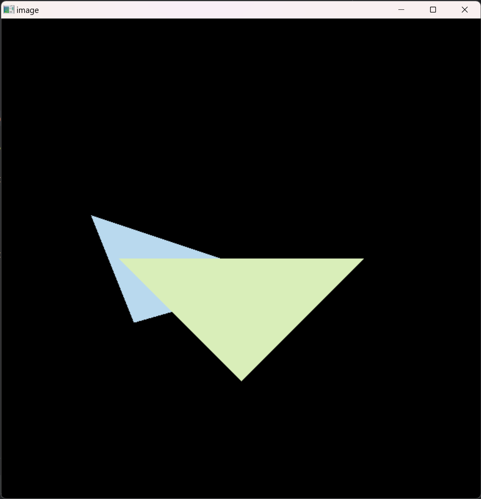

# Games101Homeworks
Games101‘s Homeworks
## Assignment0 配置环境
安装eigen即可
```c++
    Eigen::Vector3d p(2, 1, 1);
    int theta = 45;
    Eigen::Matrix3d rotate, translate;
    rotate << cos(theta), -sin(theta), 0, sin(theta), cos(theta), 0, 0, 0, 1;
    p = rotate * p;
    cout << p << endl;
    translate << 1, 0, 1, 0, 1, 2, 0, 0, 1;
    p = translate * p;
    cout << p;
```
## Assignment1 填写一个旋转矩阵和一个透视投影矩阵
### 配置环境
#### 下载MinGW
https://github.com/Vuniverse0/mingwInstaller/releases  
添加环境变量到path：C:\Users\Yezi\mingw64\bin
#### 下载cmake
https://cmake.org/download/
#### 下载opencv
https://opencv.org/releases/
#### 编译opencv
https://blog.csdn.net/Dylan_YQ/article/details/122677627
```
mingw32-make -j 16
mingw32-make install
```
### 一个旋转矩阵
get_model_matrix(float rotation_angle): 逐个元素地构建模型变换矩
阵并返回该矩阵。在此函数中，你只需要实现三维中绕 z 轴旋转的变换矩阵，
而不用处理平移与缩放。
#### 思路
直接写一个绕Z轴旋转的矩阵返回即可
```c++
    model << cos(rotation_angle), -sin(rotation_angle), 0, 0,
            sin(rotation_angle), cos(rotation_angle), 0, 0,
            0, 0, 1, 0,
            0, 0, 0, 1;
```
### 一个透视投影矩阵
get_projection_matrix(float eye_fov, float aspect_ratio, float
zNear, float zFar): 使用给定的参数逐个元素地构建透视投影矩阵并返回
该矩阵。
#### 思路
先做透视投影，然后做正交投影，正交投影=平移+缩放  
平移到原点，缩放到一个标准正方体[-1,1]³中  
n 对应 zNear，f 对应 zFar，fovY 对应 eye_fov，aspect 对应 asoect_ratio  
```c++
    Eigen::Matrix4f perspective = Eigen::Matrix4f::Identity();
    perspective << zNear, 0, 0, 0,
            0, zNear, 0, 0,
            0, 0, zNear + zFar, -zNear * zFar,
            0, 0, 1, 0;
    Eigen::Matrix4f transform = Eigen::Matrix4f::Identity();
    float t=tan(eye_fov/2)*fabs(zNear);
    float r=aspect_ratio*t;
    float l=-r,b=-t;
    transform(0,3)=-(r+l)/2;
    transform(1,3)=-(t+b)/2;
    transform(2,3)=-(zNear+zFar)/2;
    Eigen::Matrix4f scale = Eigen::Matrix4f::Identity();
    scale(0,0)=2/(r-l);
    scale(1,1)=2/(t-b);
    scale(2,2)=2/(zNear-zFar)/2;
    projection=scale*transform*perspective;
```

## Assignment2 光栅化三角形
### 判断点是否在三角形内
static bool insideTriangle(): 测试点是否在三角形内。
#### 思路
叉乘可以用来判断一个点是否在一个多边形内部，如P点，如果AP×AB和BP×BC和CP×CA的方向是一样的，那么这个P点就在三角形内部
```c++
    float AB_AP=(v[1].x()-v[0].x())*(y-v[0].y())-(v[1].y()-v[0].y())*(x-v[0].x());
    float BC_BP=(v[2].x()-v[1].x())*(y-v[1].y())-(v[2].y()-v[1].y())*(x-v[1].x());
    float CA_CP=(v[0].x()-v[2].x())*(y-v[2].y())-(v[0].y()-v[2].y())*(x-v[2].x());
    if((AB_AP>0)==(BC_BP>0)&&(BC_BP>0)==(CA_CP>0))
        return true;
    return false;
```
### 光栅化三角形
rasterize_triangle()
#### 思路
先建立起一个矩形框框住三角形  
遍历矩形框内每个像素，判断该像素是否在三角形内  
如果在三角形内，插值计算深度，更新depth buffer  
渲染该像素
```c++
    int minx=std::min(v[0].x(),std::min(v[1].x(),v[2].x()));
    int miny=std::min(v[0].y(),std::min(v[1].y(),v[2].y()));
    int maxX=std::max(v[0].x(),std::max(v[1].x(),v[2].x()));
    int maxY=std::max(v[0].y(),std::max(v[1].y(),v[2].y()));
    for(int x=minx;x<=maxX;x++){
        for(int y=miny;y<=maxY;y++){
            if(insideTriangle(x,y,t.v)){
                auto[alpha, beta, gamma] = computeBarycentric2D(x, y, t.v);
                float w_reciprocal = 1.0/(alpha / v[0].w() + beta / v[1].w() + gamma / v[2].w());
                float z_interpolated = alpha * v[0].z() / v[0].w() + beta * v[1].z() / v[1].w() + gamma * v[2].z() / v[2].w();
                z_interpolated *= w_reciprocal;
                if(z_interpolated<depth_buf[get_index(x,y)]){
                    depth_buf[get_index(x,y)]=z_interpolated;
                    set_pixel(Eigen::Vector3f(x,y,1),t.getColor());
                }
            }
        }
    }
```

三角形颠倒问题  
https://zhuanlan.zhihu.com/p/509902950
## Assignment3 插值 纹理映射 blinn-phone反射模型 凹凸贴图 位移贴图
### 任务
1. 修改函数 rasterize_triangle(const Triangle& t) in rasterizer.cpp: 在此处实现与作业 2 类似的插值算法，实现法向量、颜色、纹理颜色的插值。
2. 修改函数 get_projection_matrix() in main.cpp: 将你自己在之前的实验中实现的投影矩阵填到此处，此时你可以运行./Rasterizer output.png normal 来观察法向量实现结果。
3. 修改函数 phong_fragment_shader() in main.cpp: 实现 Blinn-Phong 模型计算Fragment Color.
4. 修改函数 texture_fragment_shader() in main.cpp: 在实现 Blinn-Phong 的基础上，将纹理颜色视为公式中的 kd，实现 Texture Shading Fragment
   Shader.
5. 修改函数 bump_fragment_shader() in main.cpp: 在实现 Blinn-Phong 的基础上，仔细阅读该函数中的注释，实现 Bump mapping.
6. 修改函数 displacement_fragment_shader() in main.cpp: 在实现 Bump mapping 的基础上，实现 displacement mapping.
### 解决
#### 1. 修改函数 rasterize_triangle(const Triangle& t) in rasterizer.cpp: 在此处实现与作业 2 类似的插值算法，实现法向量、颜色、纹理颜色的插值。  
先把作业2的拉过来，增加对法向量、颜色、纹理颜色与底纹颜色 (Shading Colors) 的插值
```c++
    auto v = t.toVector4();
    int minx=std::min(v[0].x(),std::min(v[1].x(),v[2].x()));
    int miny=std::min(v[0].y(),std::min(v[1].y(),v[2].y()));
    int maxX=std::max(v[0].x(),std::max(v[1].x(),v[2].x()));
    int maxY=std::max(v[0].y(),std::max(v[1].y(),v[2].y()));
    for(int x=minx;x<=maxX;x++){
        for(int y=miny;y<=maxY;y++){
            if(insideTriangle(x,y,t.v)){
                auto[alpha, beta, gamma] = computeBarycentric2D(x, y, t.v);
                float w_reciprocal = 1.0/(alpha / v[0].w() + beta / v[1].w() + gamma / v[2].w());
                float z_interpolated = alpha * v[0].z() / v[0].w() + beta * v[1].z() / v[1].w() + gamma * v[2].z() / v[2].w();
                z_interpolated *= w_reciprocal;
                if(z_interpolated<depth_buf[get_index(x,y)]){
                    auto interpolated_color= interpolate(alpha,beta,gamma,t.color[0],t.color[1],t.color[2],1);
                    auto interpolated_normal= interpolate(alpha,beta,gamma,t.normal[0],t.normal[1],t.normal[2],1);
                    auto interpolated_texcoords= interpolate(alpha,beta,gamma,t.tex_coords[0],t.tex_coords[1],t.tex_coords[2],1);
                    auto interpolated_shadingcoords= interpolate(alpha,beta,gamma,view_pos[0],view_pos[1],view_pos[2],1);
                    fragment_shader_payload payload( interpolated_color, interpolated_normal.normalized(), interpolated_texcoords, texture ? &*texture : nullptr);
                    payload.view_pos = interpolated_shadingcoords;
                    auto pixel_color = fragment_shader(payload);
                    depth_buf[get_index(x,y)]=z_interpolated;
                    set_pixel(Eigen::Vector2i(x,y),pixel_color);
                }
            }
        }
    }
```
#### 2. 修改函数 get_projection_matrix() in main.cpp: 将你自己在之前的实验中实现的投影矩阵填到此处，此时你可以运行./Rasterizer output.png normal 来观察法向量实现结果。  
对于牛牛倒过来的和之前一样，是因为课程推导中的n和f是坐标，相机是看向-z方向的，这里n和f是距离，感觉像是相机看向z方向的，用了一个对称矩阵将x和y方向镜像就对了
```c++
    Eigen::Matrix4f mirror;
    mirror <<
           -1, 0, 0, 0,
            0, -1, 0, 0,
            0, 0, 1, 0,
            0, 0, 0, 1;
    projection=mirror*scale*transform*perspective;
```

#### 3. 修改函数 phong_fragment_shader() in main.cpp: 实现 Blinn-Phong 模型计算Fragment Color.  
根据blinn-phong反射模型计算就行
```c++
        auto r=light.position-point;
        auto l=r.normalized();
        auto v=(eye_pos-point).normalized();
        auto h=(v+l).normalized();
        Eigen::Vector3f ambient=ka.array()*amb_light_intensity.array();
        Eigen::Vector3f diffuse=kd.array()*light.intensity.array()/r.dot(r)*std::max(0.f,normal.dot(l));
        Eigen::Vector3f specular=ks.array()*light.intensity.array()/r.dot(r)*std::max(0.f,std::pow(normal.dot(h),p));
        result_color=result_color+ambient+diffuse+specular;
```

#### 4. 修改函数 texture_fragment_shader() in main.cpp: 在实现 Blinn-Phong 的基础上，将纹理颜色视为公式中的 kd，实现 Texture Shading Fragment Shader.  
根据纹理坐标映射纹理,这个纹理坐标最后在getcolor那里乘以了纹理图的宽和高，这里需要做一个[0,1]的限制
```c++
        float u=std::max(0.f,std::min(payload.tex_coords.x(),1.f));
        float v=std::max(0.f,std::min(payload.tex_coords.y(),1.f));
        return_color=payload.texture->getColor(u,v);
```

#### 5. 修改函数 bump_fragment_shader() in main.cpp: 在实现 Blinn-Phong 的基础上，仔细阅读该函数中的注释，实现 Bump mapping.  
已有的代码中的TBN矩阵用于将局部的切线空间转换为世界坐标系，根据纹理存储的相对高度计算出新的法线方向，注意使用1.f进行计算，否则是整除结果不对，然后是u+1和v+1这个1是要除以纹理的宽高，因为后面计算纹理坐标的时候会再乘以纹理宽高
```c++
    auto [x, y, z] = std::tie(normal.x(), normal.y(), normal.z());
    Eigen::Vector3f t(x * y / sqrt(x * x + z * z), sqrt(x * x + z * z), z * y / sqrt(x * x + z * z));
    auto b = normal.cross(t);
    Eigen::Matrix3f TBN;
    TBN << t.x(), b.x(), x,
            t.y(), b.y(), y,
            t.z(), b.z(), z;
    auto h = [&payload](float u, float v) -> float { return payload.texture->getColor(u, v).norm(); };
    float u = std::max(0.f, std::min(payload.tex_coords.x(), 1.f));
    float v = std::max(0.f, std::min(payload.tex_coords.y(), 1.f));
    auto dU = kh * kn * (h(u+1.f/payload.texture->width,v)-h(u,v));
    auto dV = kh * kn * (h(u,v+1.f/payload.texture->height)-h(u,v));
    Eigen::Vector3f ln(-dU, -dV, 1);
    normal= (TBN * ln).normalized();
```

#### 6. 修改函数 displacement_fragment_shader() in main.cpp: 在实现 Bump mapping 的基础上，实现 displacement mapping.  
在上一个的基础上修改着色点的位置就行
```c++
    point=point+kn * normal * h(u,v);
```
